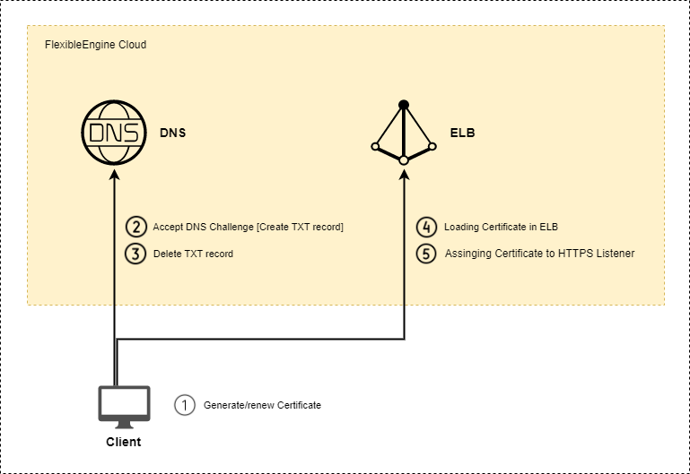

# certbot-dns-challenge-flexibleengine
Flexible Engine is a global France public cloud solution based on OpenStack technology. It is aimed at European companies of all sizes, especially those with an international presence. https://www.orange-business.com/en/products/flexible-engine
  
Certbot is a fully-featured, extensible client for the Let’s Encrypt CA (or any other CA that speaks the ACME protocol) that can automate the tasks of obtaining certificates and configuring webservers to use them. This client runs on Unix-based operating systems.
  
These scripts are extension to support Flexible Engine Cloud DNS provider. for generating/renewing letsencrypt certificates and loading them to FlexibleEngine Load Balancer (ELB).
 
The diagram below describes in detail.
  
Make sure to have already installed Certbot client on your linux machine,
for more details, please refer to documentation: https://certbot.eff.org/instructions
 
these scripts are devided in two parts.
- Script for generating the first time Letsencrypt certificate using certbot client.
- Script for renewing the certificate (renewing script can be scheduled as cron job to run in a regular timing)
 

## Setting Env variables:
Environment variables must be setted, allowing authentication and gettig API Token on the required resources.
 
https://docs.prod-cloud-ocb.orange-business.com/en-us/api/dns/en-us_topic_0037134406.html

## Generating Certificate:
'./create.sh'
 
by loading first environment variable (environment-variables.sh) and running certbot command.
 
Certbot allows for the specification of pre and post validation hooks when run in manual mode. The flags to specify these scripts are --manual-auth-hook and --manual-cleanup-hook respectively.
  
This will run the authenticator.sh script, attempt the validation, and then run the cleanup.sh script. Additionally certbot will pass relevant environment variables to these scripts:
 
- CERTBOT_DOMAIN: The domain being authenticated
- CERTBOT_VALIDATION: The validation string
- CERTBOT_TOKEN: Resource name part of the HTTP-01 challenge (HTTP-01 only)
- CERTBOT_REMAINING_CHALLENGES: Number of challenges remaining after the current challenge
- CERTBOT_ALL_DOMAINS: A comma-separated list of all domains challenged for the current certificate
 
more details, please refer to documentation: https://eff-certbot.readthedocs.io/en/stable/using.html

 

## Renewing Certificate:
'./renew.sh'
 
The 'renew.sh' script will attempt to renew certificate previously obtained for the specified domain. and load it to FlexibleEngine ELB
(domain, and auth credentials... will be retrieved from env variables script)
 

## Diagram:

 

## Links:
- API authentication: https://docs.prod-cloud-ocb.orange-business.com/en-us/api/dns/en-us_topic_0037134406.html
- Creating DNS record: https://docs.prod-cloud-ocb.orange-business.com/en-us/api/dns/dns_api_64001.html
- Putting ELB Certificate: https://docs.prod-cloud-ocb.orange-business.com/api/elb/CreateCertificate.html
- Assinging ELB Certificate to ELB Listener: https://docs.prod-cloud-ocb.orange-business.com/api/elb/UpdateListener.html
- Deleting DNS record: https://docs.prod-cloud-ocb.orange-business.com/en-us/api/dns/dns_api_64005.html
